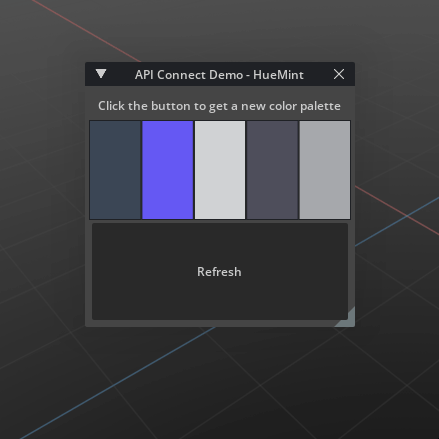

# API Connection (omni.example.apiconnect) 

​
## Overview

This Extension makes a single API call and updates UI elements. It demonstrates how to make API calls without interfering with the main loop of Omniverse.

See [Adding the Extension](../../../README.md#adding-this-extension) on how to add the extension to your project.
​
## [Tutorial](../../docs/tutorial.md)
This extension sample also includes a step-by-step tutorial to accelerate your growth as you learn to build your own Omniverse Kit extensions. 

Learn how to create an Extension that calls an API and use that information to update components within Omniverse. 

​[Get started with the tutorial here.](../../docs/tutorial.md)

## Usage

Once the extension is enabled in the *Extension Manager*, you should see a similar line inside the viewport like in the to the image before [Overview section](#overview).

Clicking on the *Refresh* button will send a request to [HueMint.com](https://huemint.com/) API. HueMint then sends back a palette of colors which is used to update the 5 color widgets in the UI. Hovering over each color widget will display the values used to define the color. The color widgets can also be clicked on which opens a color picker UI.