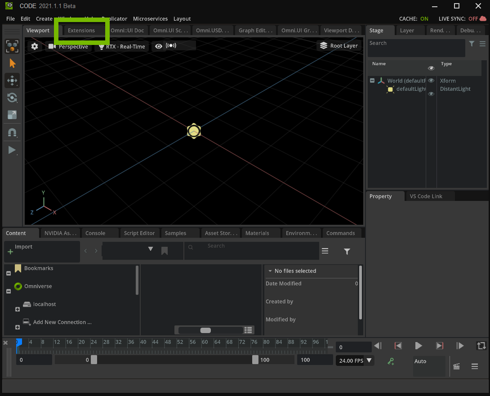

# Connecting API to Omniverse Extension

The API Connection extension shows how to communicate with an API within Omniverse. This guide is great for extension builders who want to start using their own API tools or external API tools within Omniverse.

  > NOTE: Visual Studio Code is the preferred IDE, hence forth we will be referring to it throughout this guide. 
  > NOTE: Omniverse Code is the preferred platform, hence forth we will be referring to it throughout this guide.

# Learning Objectives

In this tutorial you learn how to:
- Use `asyncio`
- Use `aiohttp` calls
- Send an API Request
- Use Results from API Request
- Use async within Omniverse


# Prerequisites
  We recommend that you complete these tutorials before moving forward:

- [Extension Environment Tutorial](https://github.com/NVIDIA-Omniverse/ExtensionEnvironmentTutorial)
- [How to make an extension by spawning prims](https://github.com/NVIDIA-Omniverse/kit-extension-sample-spawn-prims)
- [UI Window Tutorial](https://github.com/NVIDIA-Omniverse/kit-extension-sample-ui-window/blob/main/exts/omni.example.ui_window/tutorial/tutorial.md)


# Step 1: Create an Extension

> **Note:** This is a review, if you know how to create an extension, feel free to skip this step.

For this guide, we will briefly go over how to create an extension. If you have not completed [How to make an extension by spawning prims](https://github.com/NVIDIA-Omniverse/kit-extension-sample-spawn-prims/blob/main/exts/omni.example.spawn_prims/tutorial/tutorial.md) we recommend you pause here and complete that before moving forward.

## Step 1.1: Create the extension template

  In Omniverse Code navigate to the `Extensions` tab and create a new extension by clicking the ➕ icon in the upper left corner and select `New Extension Template Project`. 

Name the project to `kit-ext-apiconnect` and the extension name to `my.api.connect`.

  

> **Note:** If you don't see the *Extensions* Window, enable **Window > Extensions**:
>
> 
  

<icon>                       |  <new template>
:-------------------------:|:-------------------------:
  |  

A new extension template window and Visual Studio Code will open after you have selected the folder location, folder name, and extension ID. 

## Step 1.2: Naming your extension

  Before beginning to code, navigate into `VS Code` and change how the extension is viewed in the **Extension Manager**. It's important to give your extension a title and description for the end user to understand the extension's purpose. 

Inside of the `config` folder, locate the `extension.toml` file:

> **Note:** `extension.toml` is located inside of the `exts` folder you created for your extension.  


Inside of this file, there is a title and description for how the extension will look in the **Extension Manager**. Change the title and description for the extension. 

``` python
title = "API Connection"
description="Example on how to make an API response in Omniverse"
```

# Step 2: Set Up Window

All coding will be contained within `extension.py`.

Before setting up the API request, the first step is to get a window. The UI contained in the window will have a button to call the API and color widgets whose values will be updated based on the API's response.

## Step 2.1: Replace with Boilerplate Code

With *VS Code* open, **go to** `extension.py` and replace all the code inside with the following:

```python
import omni.ext
import omni.ui as ui
# Any class derived from `omni.ext.IExt` in top level module (defined in `python.modules` of `extension.toml`) will be
# instantiated when extension gets enabled and `on_startup(ext_id)` will be called. Later when extension gets disabled
# on_shutdown() is called.
class MyExtension(omni.ext.IExt):
    # ext_id is current extension id. It can be used with extension manager to query additional information, like where
    # this extension is located on filesystem.
    
    def on_startup(self, ext_id):
        print("[omni.example.apiconnect] MyExtension startup")

        #create a new window        
        self._window = APIWindowExample("API Connect Example", width=260, height=270)

    def on_shutdown(self):
        print("[omni.example.apiconnect] MyExtension shutdown")
        if self._window:
            self._window.destroy()
            self._window = None
```

If you were to save `extension.py` it would throw an error since we have not defined `APIWindowExample`. This step is to setup a starting point for which our window can be created and destroyed when starting up or shutting down the extension.

`APIWindowExample` will be the class we work on throughout the rest of the tutorial. 

## Step 2.2: Create `APIWindowExample` class

At the bottom of `extension.py`, **create** a new class called `APIWindowExample()`

```python
class APIWindowExample(ui.Window):
    def __init__(self, title: str, **kwargs) -> None:
        super().__init__(title, **kwargs)
        self.frame.set_build_fn(self._build_fn)
    def _build_fn(self):
        with self.frame:
            with ui.VStack(alignment=ui.Alignment.CENTER):
                ui.Label("Click the button to get a new color palette",height=30, alignment=ui.Alignment.CENTER)
```

Save `extension.py` and go back to Omniverse. 

Right now, the Window should only have a label.


## Step 2.3: Add Color Widgets

Color Widgets are buttons that display a color and can open a picker window. 

In `extension.py`, **add** the following code block under `ui.Label()`:

```python
with ui.HStack(height=100):
    color_widgets = [ui.ColorWidget(1,1,1) for i in range(5)]

#create a button to trigger the api call
self.button = ui.Button("Refresh")
```

Make sure `with ui.HStack()` is at the same indentation as `ui.Label()`.

Here we create a Horizontal Stack that will contain 5 Color Widgets. Below that will be a button labeled Refresh.

**Save** `extension.py` and go back to Omniverse. The Window will now have 5 white boxes. When hovered it will show the color values and when clicked on it will open a color picker window.


After editing `extension.py` should look like the following:


```python
import omni.ext
import omni.ui as ui
# Any class derived from `omni.ext.IExt` in top level module (defined in `python.modules` of `extension.toml`) will be
# instantiated when extension gets enabled and `on_startup(ext_id)` will be called. Later when extension gets disabled
# on_shutdown() is called.
class MyExtension(omni.ext.IExt):
    # ext_id is current extension id. It can be used with extension manager to query additional information, like where
    # this extension is located on filesystem.
    
    def on_startup(self, ext_id):
        print("[omni.example.apiconnect] MyExtension startup")

        #create a new window        
        self._window = APIWindowExample("API Connect Example", width=260, height=270)

    def on_shutdown(self):
        print("[omni.example.apiconnect] MyExtension shutdown")
        if self._window:
            self._window.destroy()
            self._window = None

class APIWindowExample(ui.Window):
    def __init__(self, title: str, **kwargs) -> None:
        super().__init__(title, **kwargs)
        self.frame.set_build_fn(self._build_fn)
    def _build_fn(self):
        with self.frame:
            with ui.VStack(alignment=ui.Alignment.CENTER):
                ui.Label("Click the button to get a new color palette",height=30, alignment=ui.Alignment.CENTER)
                with ui.HStack(height=100):
                    color_widgets = [ui.ColorWidget(1,1,1) for i in range(5)]

                #create a button to trigger the api call
                self.button = ui.Button("Refresh")
```

# Step 3: Create API Request

To make an API Request we use the `aiohttp` library. This comes packaged in the Python environment with Omniverse.

We use the `asyncio` library as well to avoid the user interface freezing when there are very expensive Python operations. Async is a single threaded / single process design because it's using cooperative multitasking.

## Step 3.1: Create a Task

1. **Add** `import asyncio` at the top of `extension.py`.

2. In `APIWindowExample` class, **add** the following function:

```python
#async function to get the color palette from huemint.com
async def get_colors_from_api(self, color_widgets):
    print("a")
    await asyncio.sleep(1)
    print("b")
```

This function contains the keyword `async` in front, meaning we cannot call it statically.

To call this function we first need to grab the current event loop.

3. Before `ui.Label()` **add** the following line:
- `run_loop = asyncio.get_event_loop()`

Now we can use the event loop to create a task that runs concurrently.

4. Before `self.button`, **add** the following block of code:

```python
def on_click():
    run_loop.create_task(self.get_colors_from_api(color_widgets))
```

`create_task` takes a coroutine, where coroutine is an object with the keyword async.

5. To connect it together **add** the following parameter in `self.button`: 
- `clicked_fn=on_click`

After editing `extension.py` should look like the following:

```python
import omni.ext
import omni.ui as ui
import asyncio
# Any class derived from `omni.ext.IExt` in top level module (defined in `python.modules` of `extension.toml`) will be
# instantiated when extension gets enabled and `on_startup(ext_id)` will be called. Later when extension gets disabled
# on_shutdown() is called.
class MyExtension(omni.ext.IExt):
    # ext_id is current extension id. It can be used with extension manager to query additional information, like where
    # this extension is located on filesystem.
    
    def on_startup(self, ext_id):
        print("[omni.example.apiconnect] MyExtension startup")

        #create a new window        
        self._window = APIWindowExample("API Connect Example", width=260, height=270)

    def on_shutdown(self):
        print("[omni.example.apiconnect] MyExtension shutdown")
        if self._window:
            self._window.destroy()
            self._window = None

class APIWindowExample(ui.Window):
    #async function to get the color palette from huemint.com
    async def get_colors_from_api(self, color_widgets):
        print("a")
        await asyncio.sleep(1)
        print("b")

    def __init__(self, title: str, **kwargs) -> None:
        super().__init__(title, **kwargs)
        self.frame.set_build_fn(self._build_fn)
    def _build_fn(self):
        with self.frame:
            with ui.VStack(alignment=ui.Alignment.CENTER):
                run_loop = asyncio.get_event_loop()
                ui.Label("Click the button to get a new color palette",height=30, alignment=ui.Alignment.CENTER)
                with ui.HStack(height=100):
                    color_widgets = [ui.ColorWidget(1,1,1) for i in range(5)]
                def on_click():
                    run_loop.create_task(self.get_colors_from_api(color_widgets))
                #create a button to trigger the api call
                self.button = ui.Button("Refresh", clicked_fn=on_click)
```

**Save** `extension.py` and go back to Omniverse. 

Now when we click on the Refresh button, in the Console tab it will print 'a' and after one second it will print 'b'.


## Step 3.2: Make API Request

To **create** the API Request, we first need to create an `aiohttp` session.
1. Add `import aiohttp` at the top of `extension.py`.

2. In `get_colors_from_api()` remove:
```python
print("a")
await asyncio.sleep(1)
print("b")
```
and **add** the following:
- `async with aiohttp.ClientSession() as session:`

With the session created, we can build the URL and data to send to the API. For this example we are using the [HueMint.com](https://huemint.com/) API. 

3. Under `aiohttp.ClientSession()`, **add** the following block of code:
```python
url = 'https://api.huemint.com/color'
data = {
    "mode":"transformer", #transformer, diffusion or random
    "num_colors":"5", # max 12, min 2
    "temperature":"1.2", #max 2.4, min 0
    "num_results":"1", #max 50 for transformer, 5 for diffusion
    "adjacency":[ "0", "0", "0", "0", "0", "0", "0", "0", "0", "0", "0", "0", "0", "0", "0", "0", "0", "0", "0", "0", "0", "0", "0", "0", "0"], #nxn adjacency matrix as a flat array of strings
    "palette":["-", "-", "-", "-", "-"], #locked colors as hex codes, or '-' if blank
    }
```

> **Note:** If you are using a different URL make sure the data passed is correct. 

4. Based on HueMint.com we will create a POST request. **Add** the following code block under `data`:
```python
try:
    #make the request    
    async with session.post(url, json=data) as resp:
        #get the response as json
        result = await resp.json(content_type=None)
        
        #get the palette from the json
        palette=result['results'][0]['palette']
        
        print(palette)
except Exception as e:
    import carb
    carb.log_info(f"Caught Exception {e}")
```

The `try / except` is used to catch when a Timeout occurs. To read more about Timeouts see [aiohttp Client Quick Start](https://docs.aiohttp.org/en/latest/client_quickstart.html).

After editing `extension.py` should look like the following:

```python
import omni.ext
import omni.ui as ui
import asyncio
import aiohttp
# Any class derived from `omni.ext.IExt` in top level module (defined in `python.modules` of `extension.toml`) will be
# instantiated when extension gets enabled and `on_startup(ext_id)` will be called. Later when extension gets disabled
# on_shutdown() is called.
class MyExtension(omni.ext.IExt):
    # ext_id is current extension id. It can be used with extension manager to query additional information, like where
    # this extension is located on filesystem.
    
    def on_startup(self, ext_id):
        print("[omni.example.apiconnect] MyExtension startup")

        #create a new window        
        self._window = APIWindowExample("API Connect Example", width=260, height=270)

    def on_shutdown(self):
        print("[omni.example.apiconnect] MyExtension shutdown")
        if self._window:
            self._window.destroy()
            self._window = None

class APIWindowExample(ui.Window):
    #async function to get the color palette from huemint.com
    async def get_colors_from_api(self, color_widgets):
        async with aiohttp.ClientSession() as session:
            url = 'https://api.huemint.com/color'
            data = {
                "mode":"transformer", #transformer, diffusion or random
                "num_colors":"5", # max 12, min 2
                "temperature":"1.2", #max 2.4, min 0
                "num_results":"1", #max 50 for transformer, 5 for diffusion
                "adjacency":[ "0", "0", "0", "0", "0", "0", "0", "0", "0", "0", "0", "0", "0", "0", "0", "0", "0", "0", "0", "0", "0", "0", "0", "0", "0"], #nxn adjacency matrix as a flat array of strings
                "palette":["-", "-", "-", "-", "-"], #locked colors as hex codes, or '-' if blank
                }
            try:
                #make the request    
                async with session.post(url, json=data) as resp:
                    #get the response as json
                    result = await resp.json(content_type=None)
                    
                    #get the palette from the json
                    palette=result['results'][0]['palette']
                    
                    print(palette)
            except Exception as e:
                import carb
                carb.log_info(f"Caught Exception {e}")

    def __init__(self, title: str, **kwargs) -> None:
        super().__init__(title, **kwargs)
        self.frame.set_build_fn(self._build_fn)
    def _build_fn(self):
        with self.frame:
            with ui.VStack(alignment=ui.Alignment.CENTER):
                run_loop = asyncio.get_event_loop()
                ui.Label("Click the button to get a new color palette",height=30, alignment=ui.Alignment.CENTER)
                with ui.HStack(height=100):
                    color_widgets = [ui.ColorWidget(1,1,1) for i in range(5)]
                def on_click():
                    run_loop.create_task(self.get_colors_from_api(color_widgets))
                #create a button to trigger the api call
                self.button = ui.Button("Refresh", clicked_fn=on_click)
```

**Save** `extension.py` and go back to Omniverse.

When clicking on the Refresh button our Extension will now call the API, grab the JSON response, and store it in `palette`. We can see the value for `palette` in the Console Tab.


# Step 4: Apply Results

Now that the API call is returning a response, we can now take that response and apply it to our color widgets in the Window.

## Step 4.1: Setup `apply_colors()`

To apply the colors received from the API, **create** the following two functions inside of `APIWindowExample`:

```python
#apply the colors fetched from the api to the color widgets
async def apply_colors(self, palette, color_widgets):
    colors = [palette[i] for i in range(5)]
    index = 0
    for color_widget in color_widgets:
        await omni.kit.app.get_app().next_update_async()
        #we get the individual RGB colors from ColorWidget model
        color_model = color_widget.model
        children = color_model.get_item_children()
        hex_to_float = self.hextofloats(colors[index])
        #we set the color of the color widget to the color fetched from the api
        color_model.get_item_value_model(children[0]).set_value(hex_to_float[0])
        color_model.get_item_value_model(children[1]).set_value(hex_to_float[1])
        color_model.get_item_value_model(children[2]).set_value(hex_to_float[2])
        index = index + 1

#hex to float conversion for transforming hex color codes to float values
def hextofloats(self, h):
    #Convert hex rgb string in an RGB tuple (float, float, float)
    return tuple(int(h[i:i + 2], 16) / 255. for i in (1, 3, 5)) # skip '#' 
```

In Kit there is a special awaitable: `await omni.kit.app.get_app().next_update_async()`
- This waits for the next frame within Omniverse to run. It is used when you want to execute something with a one-frame delay.
- Why do we need this?
    - Without this, running Python code that is expensive can cause the user interface to freeze

## Step 4.2: Link it together

Inside `get_colors_from_api()` **replace** `print()` with the following line:
- `await self.apply_colors(palette, color_widgets)`


After editing `extension.py` should look like the following:

```python
import omni.ext
import omni.ui as ui
import asyncio
import aiohttp
# Any class derived from `omni.ext.IExt` in top level module (defined in `python.modules` of `extension.toml`) will be
# instantiated when extension gets enabled and `on_startup(ext_id)` will be called. Later when extension gets disabled
# on_shutdown() is called.
class MyExtension(omni.ext.IExt):
    # ext_id is current extension id. It can be used with extension manager to query additional information, like where
    # this extension is located on filesystem.
    
    def on_startup(self, ext_id):
        print("[omni.example.apiconnect] MyExtension startup")

        #create a new window        
        self._window = APIWindowExample("API Connect Example", width=260, height=270)

    def on_shutdown(self):
        print("[omni.example.apiconnect] MyExtension shutdown")
        if self._window:
            self._window.destroy()
            self._window = None

class APIWindowExample(ui.Window):
    #async function to get the color palette from huemint.com
    async def get_colors_from_api(self, color_widgets):
        async with aiohttp.ClientSession() as session:
            url = 'https://api.huemint.com/color'
            data = {
                "mode":"transformer", #transformer, diffusion or random
                "num_colors":"5", # max 12, min 2
                "temperature":"1.2", #max 2.4, min 0
                "num_results":"1", #max 50 for transformer, 5 for diffusion
                "adjacency":[ "0", "0", "0", "0", "0", "0", "0", "0", "0", "0", "0", "0", "0", "0", "0", "0", "0", "0", "0", "0", "0", "0", "0", "0", "0"], #nxn adjacency matrix as a flat array of strings
                "palette":["-", "-", "-", "-", "-"], #locked colors as hex codes, or '-' if blank
                }
            try:
                #make the request    
                async with session.post(url, json=data) as resp:
                    #get the response as json
                    result = await resp.json(content_type=None)
                    
                    #get the palette from the json
                    palette=result['results'][0]['palette']
                    
                    await self.apply_colors(palette, color_widgets)
            except Exception as e:
                import carb
                carb.log_info(f"Caught Exception {e}")

    #apply the colors fetched from the api to the color widgets
    async def apply_colors(self, palette, color_widgets):
        colors = [palette[i] for i in range(5)]
        index = 0
        for color_widget in color_widgets:
            await omni.kit.app.get_app().next_update_async()
            #we get the individual RGB colors from ColorWidget model
            color_model = color_widget.model
            children = color_model.get_item_children()
            hex_to_float = self.hextofloats(colors[index])
            #we set the color of the color widget to the color fetched from the api
            color_model.get_item_value_model(children[0]).set_value(hex_to_float[0])
            color_model.get_item_value_model(children[1]).set_value(hex_to_float[1])
            color_model.get_item_value_model(children[2]).set_value(hex_to_float[2])
            index = index + 1

    #hex to float conversion for transforming hex color codes to float values
    def hextofloats(self, h):
        #Convert hex rgb string in an RGB tuple (float, float, float)
        return tuple(int(h[i:i + 2], 16) / 255. for i in (1, 3, 5)) # skip '#' 

    def __init__(self, title: str, **kwargs) -> None:
        super().__init__(title, **kwargs)
        self.frame.set_build_fn(self._build_fn)
    def _build_fn(self):
        with self.frame:
            with ui.VStack(alignment=ui.Alignment.CENTER):
                run_loop = asyncio.get_event_loop()
                ui.Label("Click the button to get a new color palette",height=30, alignment=ui.Alignment.CENTER)
                with ui.HStack(height=100):
                    color_widgets = [ui.ColorWidget(1,1,1) for i in range(5)]
                def on_click():
                    run_loop.create_task(self.get_colors_from_api(color_widgets))
                #create a button to trigger the api call
                self.button = ui.Button("Refresh", clicked_fn=on_click)
```

**Save** `extension.py` and go back to Omniverse. When clicking on the Refresh button our color widgets in the window will now update based on the results given by the API response.


# Step 5: Visualize Progression

Some API responses might not be as quick to return a result. Visual indicators can be added to indicate to the user that the extension is waiting for an API response.

Examples can be loading bars, spinning circles, percent numbers, etc.

For this example, we are going to change "Refresh" to "Loading" and as time goes on it will add up to three periods after Loading before resetting.

How it looks when cycling:
- Loading
- Loading.
- Loading..
- Loading...
- Loading

## Step 5.1: Run Forever Task

Using `async`, we can create as many tasks to run concurrently. One task so far is making a request to the API and our second task will be running the Loading visuals.

**Add** the following code block in `APIWindowExample`:

```python
async def run_forever(self):
    count = 0
    dot_count = 0
    while True:
        if count % 10 == 0:
            if dot_count == 3:
                self.button.text = "Loading"
                dot_count = 0
            else:
                self.button.text += "."
                dot_count += 1
        count += 1
        await omni.kit.app.get_app().next_update_async()
```

> **Note:** This function will run forever. When creating coroutines make sure there is a way to end the process or cancel it to prevent it from running the entire time.

Again we use `next_update_async()` to prevent the user interface from freezing.

## Step 5.2: Cancelling Tasks

As noted before this coroutine runs forever so after we apply the colors we will cancel that task to stop it from running.

1. At the front of `get_colors_from_api()` **add** the following lines:
```python
self.button.text = "Loading"
task = asyncio.create_task(self.run_forever())
```
To cancel a task we need a reference to the task that was created.

2. In `get_colors_from_api()` and after `await self.apply_colors()` **add** the following lines:
```python
task.cancel()
self.button.text = "Refresh"
```

3. After `carb.log_info()`, **add** the following lines:
```python
task.cancel()
self.button.text = "Connection Timed Out \nClick to Retry"
```

After editing `extension.py` should look like the following:

```python
import omni.ext
import omni.ui as ui
import asyncio
import aiohttp
# Any class derived from `omni.ext.IExt` in top level module (defined in `python.modules` of `extension.toml`) will be
# instantiated when extension gets enabled and `on_startup(ext_id)` will be called. Later when extension gets disabled
# on_shutdown() is called.
class MyExtension(omni.ext.IExt):
    # ext_id is current extension id. It can be used with extension manager to query additional information, like where
    # this extension is located on filesystem.
    
    def on_startup(self, ext_id):
        print("[omni.example.apiconnect] MyExtension startup")

        #create a new window        
        self._window = APIWindowExample("API Connect Example", width=260, height=270)

    def on_shutdown(self):
        print("[omni.example.apiconnect] MyExtension shutdown")
        if self._window:
            self._window.destroy()
            self._window = None

class APIWindowExample(ui.Window):
    #async function to get the color palette from huemint.com
    async def get_colors_from_api(self, color_widgets):
        self.button.text = "Loading"
        task = asyncio.create_task(self.run_forever())
        async with aiohttp.ClientSession() as session:
            url = 'https://api.huemint.com/color'
            data = {
                "mode":"transformer", #transformer, diffusion or random
                "num_colors":"5", # max 12, min 2
                "temperature":"1.2", #max 2.4, min 0
                "num_results":"1", #max 50 for transformer, 5 for diffusion
                "adjacency":[ "0", "0", "0", "0", "0", "0", "0", "0", "0", "0", "0", "0", "0", "0", "0", "0", "0", "0", "0", "0", "0", "0", "0", "0", "0"], #nxn adjacency matrix as a flat array of strings
                "palette":["-", "-", "-", "-", "-"], #locked colors as hex codes, or '-' if blank
                }
            try:
                #make the request    
                async with session.post(url, json=data) as resp:
                    #get the response as json
                    result = await resp.json(content_type=None)
                    
                    #get the palette from the json
                    palette=result['results'][0]['palette']
                    
                    await self.apply_colors(palette, color_widgets)
                    task.cancel()
                    self.button.text = "Refresh"
            except Exception as e:
                import carb
                carb.log_info(f"Caught Exception {e}")
                task.cancel()
                self.button.text = "Connection Timed Out \nClick to Retry"

    #apply the colors fetched from the api to the color widgets
    async def apply_colors(self, palette, color_widgets):
        colors = [palette[i] for i in range(5)]
        index = 0
        for color_widget in color_widgets:
            await omni.kit.app.get_app().next_update_async()
            #we get the individual RGB colors from ColorWidget model
            color_model = color_widget.model
            children = color_model.get_item_children()
            hex_to_float = self.hextofloats(colors[index])
            #we set the color of the color widget to the color fetched from the api
            color_model.get_item_value_model(children[0]).set_value(hex_to_float[0])
            color_model.get_item_value_model(children[1]).set_value(hex_to_float[1])
            color_model.get_item_value_model(children[2]).set_value(hex_to_float[2])
            index = index + 1

    async def run_forever(self):
        count = 0
        dot_count = 0
        while True:
            if count % 10 == 0:
                if dot_count == 3:
                    self.button.text = "Loading"
                    dot_count = 0
                else:
                    self.button.text += "."
                    dot_count += 1
            count += 1
            await omni.kit.app.get_app().next_update_async()

    #hex to float conversion for transforming hex color codes to float values
    def hextofloats(self, h):
        #Convert hex rgb string in an RGB tuple (float, float, float)
        return tuple(int(h[i:i + 2], 16) / 255. for i in (1, 3, 5)) # skip '#' 

    def __init__(self, title: str, **kwargs) -> None:
        super().__init__(title, **kwargs)
        self.frame.set_build_fn(self._build_fn)
    def _build_fn(self):
        with self.frame:
            with ui.VStack(alignment=ui.Alignment.CENTER):
                run_loop = asyncio.get_event_loop()
                ui.Label("Click the button to get a new color palette",height=30, alignment=ui.Alignment.CENTER)
                with ui.HStack(height=100):
                    color_widgets = [ui.ColorWidget(1,1,1) for i in range(5)]
                def on_click():
                    run_loop.create_task(self.get_colors_from_api(color_widgets))
                #create a button to trigger the api call
                self.button = ui.Button("Refresh", clicked_fn=on_click)
```

**Save** `extension.py` and go back to Omniverse. Clicking the Refresh Button now will display a visual progression to let the user know that the program is running. Once the program is done the button will revert back to displaying "Refresh" instead of "Loading".

